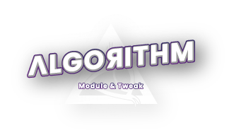

<!-- # ========================================================================

# Mobile Legends Bang Bang All Tweaks for Smartphone [root] and [non-root]
# Name      : MLBB Tweaks Performance
# Author    : Algorithm Dev / Kreapic (t.me/algorithmdev)
# Version   : 1.0.2-Beta

# ======================================================================== -->
<h2 align="center">

</h2>

<h1 align="center">MLBB Tweaks</h1>

<b>Version 1.0.2-Beta</b>

    
    
    <h3>
        MLBB Tweak berfungsi meningkatkan kinerja ponsel saat bermain game Mobile Legends Bang-Bang untuk ponsel [root] dan [non-root].
    </h3>

## Feature

- Enable Performance Mode
- Enable Hardware Rendering
- Change Rendering
- Change GPU Governor
- Unlock Ultra FPS & Grafik
- Stabilization FPS
- Improve Touch Response/Sampling Rate

## Download

## Installation

- Installation Guide [here](https://github.com/mahisataruna/MLBB-Tweaks/blob/v1.0-Beta/Installation-Guide.txt)

## Changelog

- Check out what's new [here](https://github.com/mahisataruna/MLBB-Tweaks/blob/v1.0-Beta/CHANGELOG.md)

## Link

## Notes

<b>Do With Your Own Risk!</b>
